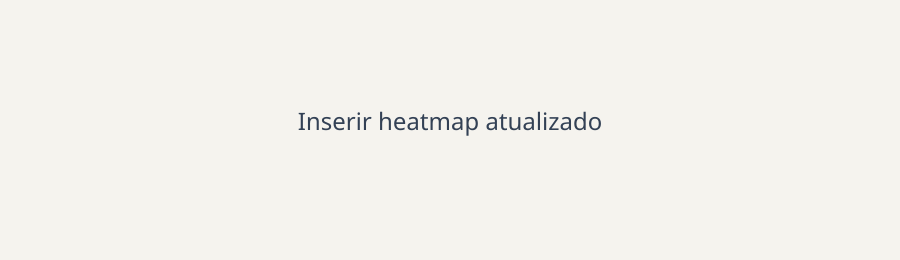

# A Equipe

## Integrantes

As fotos devem ser adicionadas em `docs/assets/images/equipe/`. Esta pagina nao deve conter numeros de matricula.

| Foto | Nome | Papel principal |
| --- | --- | --- |
| { width="120" } | _Nome completo_ | _Papel ou responsabilidade_ |
| { width="120" } | _Nome completo_ | _Papel ou responsabilidade_ |
| { width="120" } | _Nome completo_ | _Papel ou responsabilidade_ |

## Disponibilidade da equipe

O heatmap abaixo deve representar a disponibilidade semanal consolidada da equipe. Substitua o arquivo pelo heatmap atualizado, mantendo texto alternativo descritivo.

| Faixa de horario | Segunda | Terca | Quarta | Quinta | Sexta |
| --- | --- | --- | --- | --- | --- |
| Manha | _Preencher_ | _Preencher_ | _Preencher_ | _Preencher_ | _Preencher_ |
| Tarde | _Preencher_ | _Preencher_ | _Preencher_ | _Preencher_ | _Preencher_ |
| Noite | _Preencher_ | _Preencher_ | _Preencher_ | _Preencher_ | _Preencher_ |

*Fonte: levantamento interno de disponibilidade da equipe, atualizado em _data_.*
