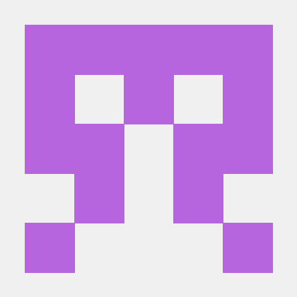

# A Equipe

## Integrantes

| Foto | Nome | Papel principal |
| --- | --- | --- |
| { width="120" } | [Alexandre Vilar](https://github.com/AlexandreVvF14) | _Papel ou responsabilidade_ |
| { width="120" } | [Camile Barbosa](https://github.com/Camile0318) | _Papel ou responsabilidade_ |
| { width="120" } | [Eduardo Ribeiro](https://github.com/EduardoRGS) | _Papel ou responsabilidade_ |
| { width="120" } | [Henrique Schneider](https://github.com/SchneiderCode1) | _Papel ou responsabilidade_ |
| { width="120" } | [João Vitor](https://github.com/Vt010) | _Papel ou responsabilidade_ |

## Disponibilidade da equipe

O quadro abaixo apresenta a disponibilidade semanal consolidada da equipe. Ele e carregado diretamente do When2Meet e pode ser atualizado pelos integrantes sem precisar alterar o GitHub Pages.

<iframe
	src="https://www.when2meet.com/?38373487-SW1oI"
	title="Quadro de disponibilidade da equipe no When2Meet"
	width="100%"
	height="720"
	loading="lazy"
	style="border: 1px solid var(--md-default-fg-color--lightest); border-radius: 4px;"
></iframe>

[Abrir o quadro de disponibilidade no When2Meet](https://www.when2meet.com/?38373487-SW1oI){ .md-button target="_blank" rel="noopener" }

| Faixa de horario | Segunda | Terca | Quarta | Quinta | Sexta |
| --- | --- | --- | --- | --- | --- |
| Manha | _Preencher_ | _Preencher_ | _Preencher_ | _Preencher_ | _Preencher_ |
| Tarde | _Preencher_ | _Preencher_ | _Preencher_ | _Preencher_ | _Preencher_ |
| Noite | _Preencher_ | _Preencher_ | _Preencher_ | _Preencher_ | _Preencher_ |

*Fonte: levantamento interno de disponibilidade da equipe, atualizado em _data_.*
