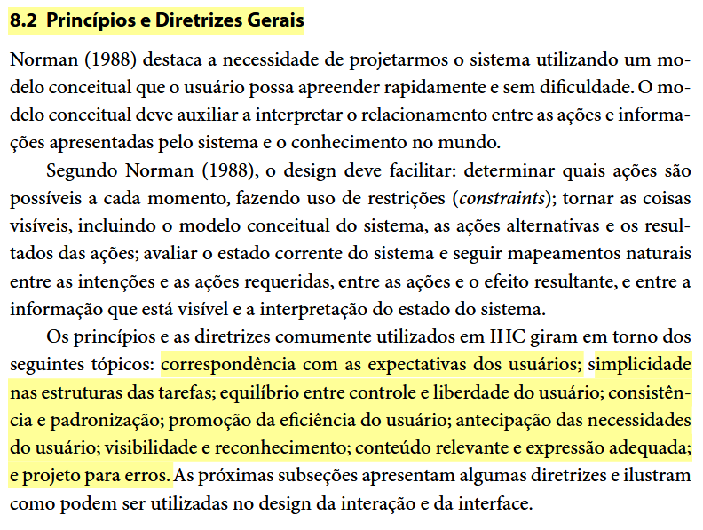
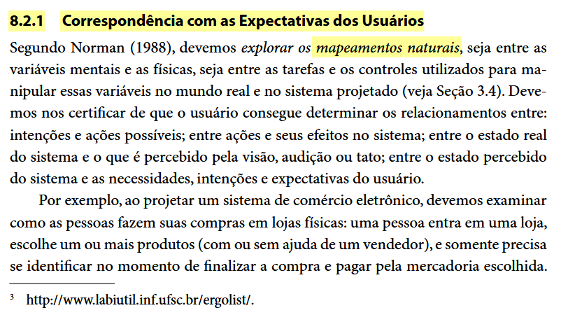
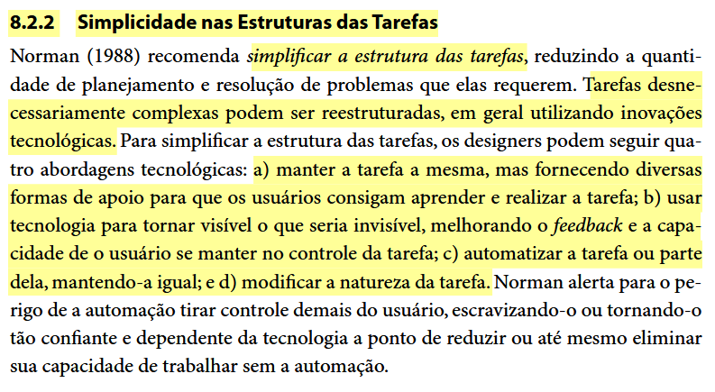
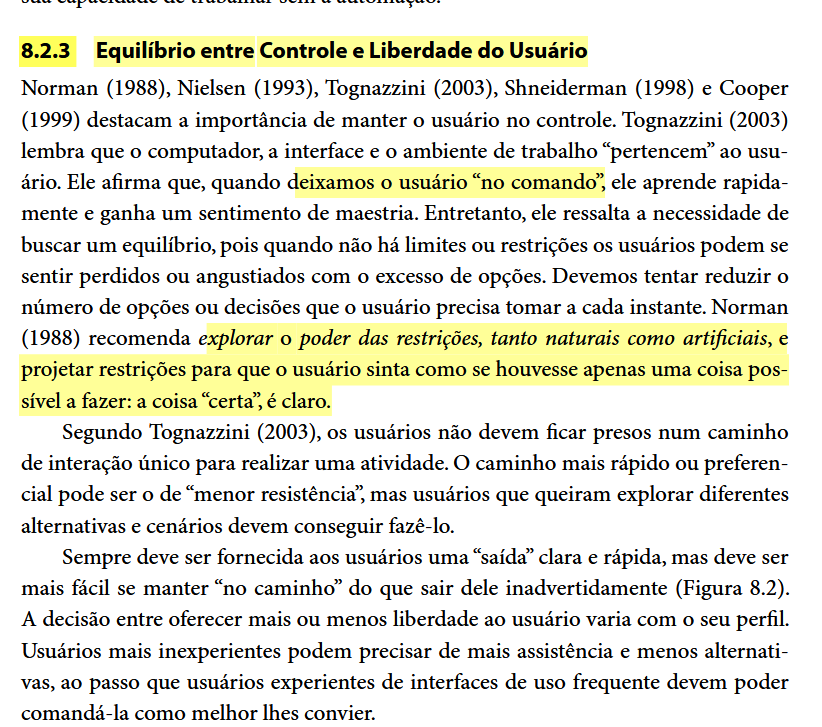
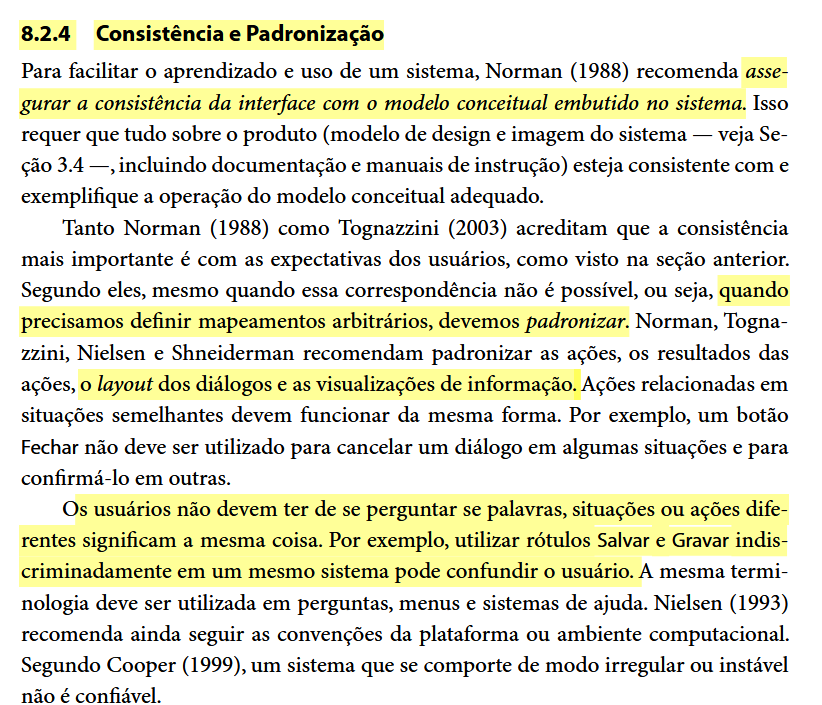
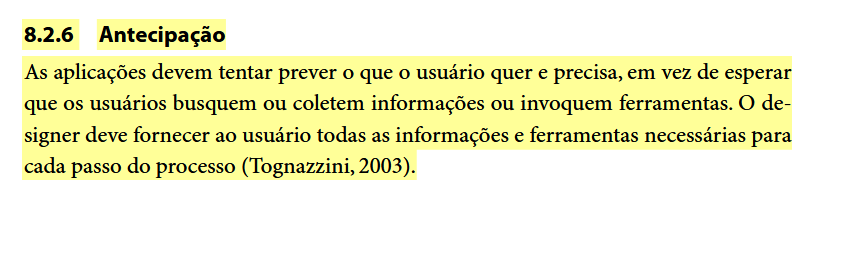
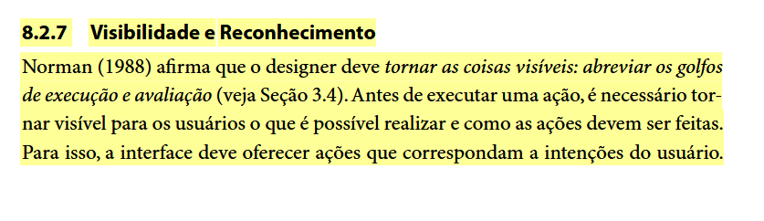
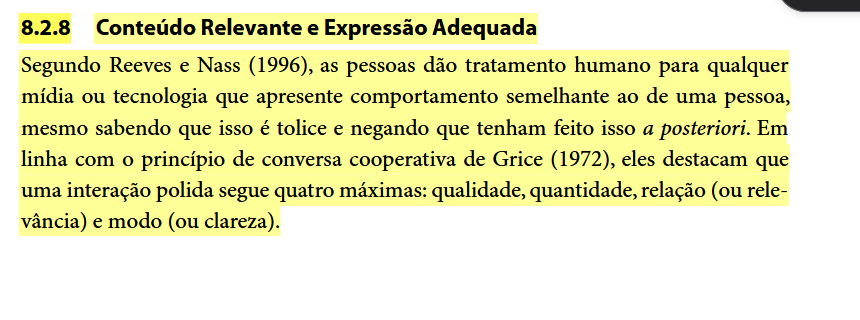
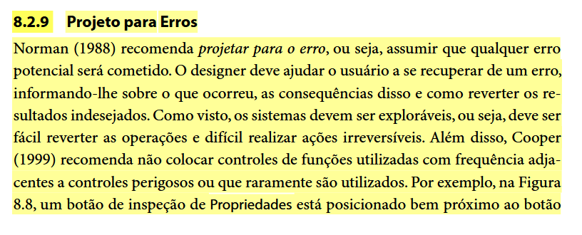
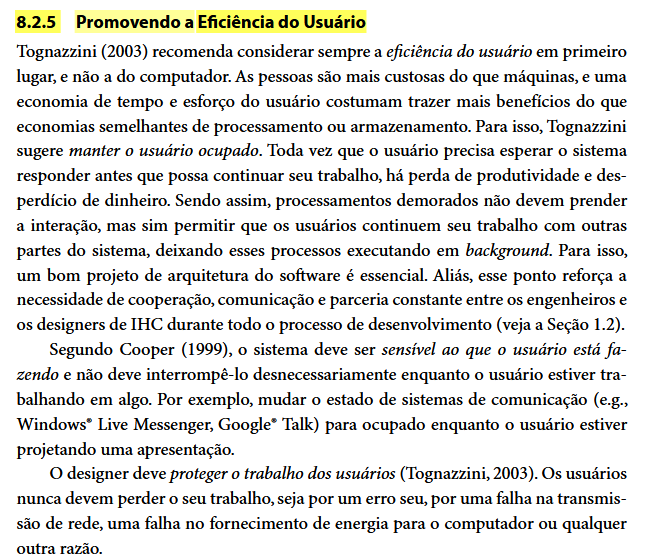

# Princípios Gerais de Projeto

---

<b>Tabela 1</b> – Histórico de Versões do Documento Princípios de Usabilidade.

| Data | Versão | Descrição | Autor(es) | Revisor(es) |
| :---: | :---: | :--- | :--- | :--- |
| 06/10/2026 | 1.0 | Criação do Documento | Henrique Schneider | Integrantes do Grupo |
| 06/10/2026 | 1.1 | Adição dos principios gerais e conformidades do Detran-DF | Henrique Schneider, Alexandre Vilar | João Vitor |

<b>Fonte</b>: Elaborado pelos autores (2026).

---

### Fundamentação Teórica

Segundo Barbosa e Silva (2010), a construção de interfaces de usuário apoia-se em princípios e diretrizes projetados para garantir uma boa qualidade de uso. A literatura destaca a importância de explorar o mapeamento natural entre as variáveis mentais e físicas, e simplificar a estrutura das tarefas para reduzir a sobrecarga cognitiva do usuário. 

Quadro 1 – Print da fundamentação teórica sobre Princípios e Diretrizes.

Fonte: BARBOSA; SILVA (2010, p. 264).

### Diretrizes e Princípios Aplicados ao Detran-DF

A avaliação e o projeto da interface do portal do Detran-DF estão embasados em 8 (oito) princípios e tópicos gerais de projeto descritos por Barbosa e Silva (2010). A aplicação de cada princípio visa solucionar rupturas de usabilidade específicas observadas no contexto do cidadão que busca serviços de trânsito.

**1. Correspondência com as expectativas dos usuários**
*   **Fundamentação:** O design deve explorar mapeamentos naturais entre intenções, ações e resultados visíveis, utilizando conceitos familiares ao invés de jargões de sistema.
*   **Aplicação no Detran-DF:** O portal deve adotar nomenclaturas claras e do dia a dia do cidadão (ex: "Débitos e Multas" ao invés de termos puramente legais ou técnicos obscuros) para que a navegação seja intuitiva.

Quadro 2 - Fonte de Correspondência item 1

Fonte: BARBOSA; SILVA (2010, p. 264).

**2. Simplicidade nas estruturas das tarefas**
*   **Fundamentação:** Reduzir a quantidade de planejamento e resolução de problemas necessários para a conclusão de uma tarefa, eliminando passos desnecessários.
*   **Aplicação no Detran-DF:** Simplificar o fluxo de emissão de guias de pagamento (PIX ou Boleto) garantindo que o usuário chegue ao seu objetivo no menor número de passos possível, minimizando preenchimentos repetitivos.

Quadro 3 - Fonte de Correspondência item 2

Fonte: BARBOSA; SILVA (2010, p. 267).

**3. Equilíbrio entre controle e liberdade do usuário**
*   **Fundamentação:** Os usuários devem sentir que controlam o sistema e que este responde às suas ações. O sistema deve disponibilizar opções claras de cancelar, desfazer e refazer (a "saída de emergência").
*   **Aplicação no Detran-DF:** As solicitações irreversíveis, como a solicitação de uma 2ª via de CNH, não devem avançar diretamente para o pagamento. O sistema deve fornecer telas intermediárias com botões visíveis de "Cancelar" e "Voltar".

Quadro 4 - Fonte de Correspondência item 3

Fonte: BARBOSA; SILVA (2010, p. 267).

**4. Consistência e padronização**
*   **Fundamentação:** A consistência evita que o usuário tenha dúvidas se palavras, símbolos ou ações diferentes significam a mesma coisa.
*   **Aplicação no Detran-DF:** Manter a consistência visual em todo o portal, garantindo que botões principais (como o login via Gov.br) não apresentem estados confusos ou aparência "esmaecida" de forma inconsistente após uma falha de conexão.

Quadro 5 - Fonte de Correspondência item 4

Fonte: BARBOSA; SILVA (2010, p. 270).

**5. Antecipação**
*   **Fundamentação:** O software deve antecipar as necessidades do usuário, fornecendo informações e ferramentas adequadas para cada passo do processo.
*   **Aplicação no Detran-DF:** Ao invés de aguardar que o cidadão erre o preenchimento da Placa ou Renavam, o formulário deve conter máscaras de entrada e instruções proativas sobre o formato correto esperado.

Quadro 6 - Fonte de Correspondência item 5 

Fonte: BARBOSA; SILVA (2010, p. 272).

**6. Visibilidade e reconhecimento**
*   **Fundamentação:** Avaliar o estado corrente do sistema, mantendo o usuário informado sobre as operações em andamento por meio de feedback imediato e claro.
*   **Aplicação no Detran-DF:** Ao emitir um boleto ou submeter uma consulta, o sistema deve exibir mensagens temporárias (toast ou modais) confirmando o processamento antes de prosseguir com a ação de download.

Quadro 7 - Fonte de Correspondência item 6

Fonte: BARBOSA; SILVA (2010, p. 273).

**7. Conteúdo relevante e expressão adequada**
*   **Fundamentação:** O sistema deve tomar a iniciativa de oferecer ajuda focada na tarefa do usuário e evitar apresentar informações ou passos inúteis que o sobrecarreguem. A documentação deve ser concisa e focada em ações concretas.
*   **Aplicação no Detran-DF:** Inserir guias rápidos e instruções contextuais nas telas de preenchimento, ajudando o cidadão na hora exata em que ele precisa emitir uma taxa, já que o portal atualmente não conta com guias passo a passo integrados aos formulários.

Quadro 8 - Fonte de Correspondencia item 7

Fonte: BARBOSA; SILVA (2010, p. 275).

**8. Projeto para erros**
*   **Fundamentação:** O sistema deve ter um design que se preocupe ativamente em prevenir erros. Quando os erros ocorrem, as mensagens devem indicar de forma construtiva como corrigir o problema, ao invés de mensagens vagas.
*   **Aplicação no Detran-DF:** Corrigir as mensagens de erro vagas (como "Carro não encontrado"). O sistema deve especificar visualmente qual campo (Placa ou Renavam) contém a divergência, sugerindo a correção correta ao cidadão. Deve também tratar falhas críticas de autenticação sem forçar o fechamento completo da sessão do usuário.

Quadro 9 - Fonte de Correspondência item 8

Fonte: BARBOSA; SILVA (2010, p. 277).

**8. Promovendo a Eficiência do Usuário**
*   **Fundamentação:** Segundo Tognazzini (2003) citado em Barbosa e Silva (2010), ao projetar um sistema interativo, deve-se considerar sempre a eficiência do usuário em primeiro lugar, e não a do computador. As pessoas são mais custosas do que as máquinas, de modo que uma economia no tempo e esforço cognitivo do usuário costuma trazer mais benefícios reais. O sistema deve manter o usuário produtivo e evitar interrompê-lo desnecessariamente com processos de *background* ou passos burocráticos irrelevantes para sua tarefa atual.

Além disso, Cooper (1999) reforça que o sistema deve proteger o trabalho dos usuários, garantindo que eles não percam seu progresso ou informações preenchidas devido a erros de navegação, quedas de conexão ou *timeouts* excessivamente rigorosos.

A avaliação heurística e o projeto de interface do portal do Detran-DF incorporam as diretrizes de promoção da eficiência do usuário, buscando eliminar gargalos que desperdiçam o tempo do cidadão e do servidor durante a busca por serviços de trânsito.

*   **Aplicação no Detran-DF:** A avaliação heurística e o projeto de interface do portal do Detran-DF incorporam as diretrizes de promoção da eficiência do usuário, buscando eliminar gargalos que desperdiçam o tempo do cidadão e do servidor durante a busca por serviços de trânsito.

**1. Minimização do Tempo de Espera e Navegação**
*   **Fundamentação:** O sistema não deve exigir que o usuário percorra caminhos longos ou aguarde processamentos travados na tela para realizar tarefas rotineiras. Os fluxos devem ser ágeis e exigir o menor número de cliques possível.
*   **Aplicação no Detran-DF:** O portal deve manter e aprimorar a seção de atalhos rápidos na página inicial (*Home*), permitindo que serviços altamente requisitados (como a consulta de CNH e a emissão de débitos) sejam acessados diretamente por usuários experientes e novatos, sem a necessidade de navegar por múltiplos submenus.

**2. Proteção do Trabalho e dos Dados do Usuário**
*   **Fundamentação:** O usuário nunca deve perder os dados preenchidos em um formulário extenso por falhas de sessão ou *timeout*, sendo dever do sistema proteger esse progresso.
*   **Aplicação no Detran-DF:** O portal deve tratar de forma elegante as quedas de sessão na integração com o Gov.br. Ao invés de travar o portal e forçar o fechamento do navegador (o que descarta qualquer preenchimento feito pelo usuário), o sistema deve oferecer uma forma de "Reconectar" e retomar o serviço exatamente do ponto onde parou.

**3. Redução de Passos Intermediários Desnecessários**
*   **Fundamentação:** Processos demorados ou que bloqueiam a atenção devem ser evitados, liberando o usuário para prosseguir rapidamente.
*   **Aplicação no Detran-DF:** A simplificação do fluxo de pagamento (disponibilização de código PIX diretamente na tela, sem exigir múltiplos downloads e aberturas de PDFs) é uma forma direta de priorizar o tempo e a conveniência do cidadão, tornando a tarefa final eficiente.

Quadro 10 - Fonte de Correspondência item 9

Fonte: BARBOSA; SILVA (2010, p. 271).

### Referências Bibliográficas

BARBOSA, Simone Diniz Junqueira; SILVA, Bruno Santana da. **Interação Humano-Computador**. Rio de Janeiro: Elsevier, 2010.

