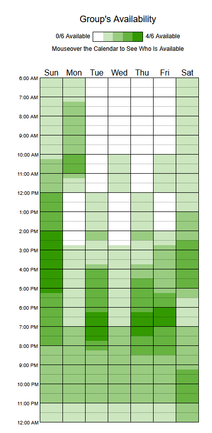

# Heatmap de Disponibilidade

## Histórico de versões e contribuições

| Data | Versão | Descrição | Autor | Revisor |
| --- | --- | --- | --- | --- |
| 10/09/2026 | 1.1 | Inclusão da imagem do heatmap e síntese dos horários de maior disponibilidade dos quatro integrantes. | Eduardo Ribeiro | A definir |
| 06/09/2026 | 1.0 | Registro do método de coleta e da disponibilidade dos integrantes. | Henrique Schneider | A definir |

## Introdução

O heatmap apresenta visualmente os períodos de disponibilidade dos quatro integrantes do Grupo 3. Seu objetivo é apoiar a definição dos horários de reuniões e a distribuição das atividades do planejamento do projeto. Quanto mais escura a faixa de cor, maior é a quantidade de integrantes disponíveis naquele período.

## Conteúdo da página

Os dados foram coletados por meio do When2Meet, ferramenta utilizada para comparar a disponibilidade informada pelos integrantes (WHEN2MEET, 2026). A imagem abaixo apresenta a consolidação visual dos horários registrados.

**Figura 1 – Heatmap de disponibilidade dos integrantes**

*Fonte: elaborado pelos autores (2026), com dados coletados no When2Meet (WHEN2MEET, 2026).*

### Análise

As faixas de maior sobreposição, representadas pelas tonalidades mais escuras, indicam períodos em que os quatro integrantes estavam disponíveis simultaneamente. A leitura do gráfico aponta como janelas preferenciais as seguintes faixas aproximadas:

**Tabela 1 – Faixas de maior disponibilidade dos integrantes**

| Dia | Faixa de maior disponibilidade | Quantidade indicada |
| --- | --- | ---: |
| Domingo | 12h às 17h | 4/4 |
| Segunda-feira | 10h às 11h | 4/4 |
| Terça-feira | 16h às 20h | 4/4 |
| Quarta-feira | 18h às 19h | 4/4 |
| Quinta-feira | 17h às 20h | 4/4 |
| Sexta-feira | 18h às 19h | 4/4 |
| Sábado | 15h às 17h | 4/4 |

*Fonte: elaborado pelos autores (2026), por interpretação dos dados coletados no When2Meet (WHEN2MEET, 2026).*

Esses horários servem como referência inicial para reuniões síncronas. A confirmação de quais integrantes estão disponíveis em cada faixa deve ser feita no calendário interativo do When2Meet.

## Referências

WHEN2MEET. **When2Meet: find a time to meet**. Disponível em: <https://www.when2meet.com/>. Acesso em: 10 set. 2026.

